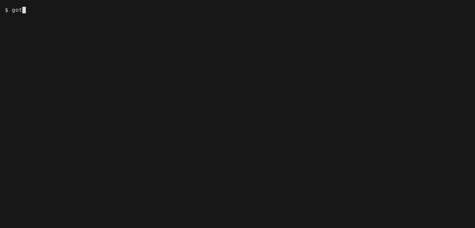
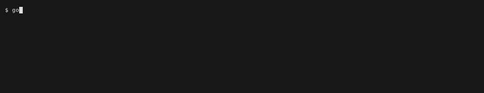

# GamesOnTheGo (GOTG)

Keep the game library on the server. Download a game to the laptop or the Steam
Deck the first time you launch it, and play it from Steam like anything else.

Three components share one contract:

| Component | What it does | Where it runs |
|---|---|---|
| **[indexer](src/gotg/indexer/)** | Indexes completed game torrents into the service catalog, and hardlinks them into `/Games` — the archive that outlives pruned torrents | In-cluster CronJob |
| **[service](src/gotg/service/)** | One endpoint holding the credentials and the saves — fronts the artwork APIs, serves the catalog, and decides save conflicts | In-cluster Deployment |
| **[client](src/client/)** | `gotg` — fetches a game on demand, builds the environment it runs in, generates a Steam launcher | Desktop, Steam Deck |

## The entry-id contract

```
/Games/<platform>/<region>.<title_slug>[.<ext>]
```

The entry name **minus its extension** is the game id, used verbatim as the
server path, the catalog key, the launcher filename and the CLI argument.

- Matches `^[a-z]{3,5}\.[a-z0-9][a-z0-9_]*$` — lowercase `a-z 0-9 _` only.
- `region` is `usa`, `eur`, `jpn` or `world`.
- Files keep their real extension; directories get none.

`Legend of Zelda, The - Majora's Mask (USA).z64` becomes
`/Games/n64/usa.legend_of_zelda_majoras_mask.z64`, id
`usa.legend_of_zelda_majoras_mask`.

Ids are unique per platform but **not globally** — the same title appears in both
the N64 and SNES sets. A bare id works whenever it is unambiguous; otherwise
qualify it as `snes/usa.bugs_life`.

## Using the client

```bash
# One-time, from a terminal
nix build ~/Documents/GOTG#gotg -o ~/.local/state/gotg/app
~/.local/state/gotg/app/bin/gotg login          # service URL + token, saved 0600

gotg list                                        # what is on the server, and what is here
gotg install usa.legend_of_zelda_majoras_mask    # download + build its environment + write launcher
```

**Finding a game.** A real library runs to thousands of entries, so `list`
prints 50 and says what it left out. A pattern is a regex, matched without case
against the id, the title and the platform:

```bash
gotg list majoras_mask                 # the obvious one
gotg list zelda                        # every Zelda, on any platform
gotg list '^world\.'                   # anchored — it is a regex, not a substring
gotg list --platform snes              # exactly one platform, no regex accidents
gotg list --search zelda --platform nes --page 2   # the named spellings
gotg list --platform nes 2             # a bare number is the page
gotg list snes --all                   # a whole platform, uncut
```

A bare argument is the pattern, or the page if it is a number; `--search` and
`--page` are their named spellings, so searching for a literal number is
`--search 1997` (or a regex like `'194[2]'`). `--limit N` for some other page
size. A truncated list always says so, and names the next page — a silent one
reads as "that is everything", which is the one thing it must not.

`gotg info <id>` answers for one game — size, files, whether it is here — and
lists its mods, each reachable as `gotg play <id> <mod>`. Every command takes
`--help` (`-h`), which prints its usage and exits without touching the server.



*`gotg list zelda`, then `gotg info` on one of the results.* Recorded from
`docs/demos/gotg-find.tape`; re-record it with `docs/demos/render.sh`.

**Tab completion** covers commands, game ids and a game's variants:

```
gotg play world.legend_of_zelda<TAB>   → world.legend_of_zelda_skyward_sword_hd
gotg play usa.super_mario_sunshine <TAB>  → bse  bsmso
gotg steam add metroid<TAB>            → world.super_metroid
```



*The same three completions, live — the last one showing that `metroid` matches
anywhere in an id.* From `docs/demos/gotg-complete.tape`; re-record it with
`docs/demos/render.sh`.

**Ids match on any part**, not just the front. They begin with a region nobody
remembers — `usa.`, `world.`, `jpn.`, `eur.` — which also means the full set
shares no common prefix, so a plain prefix match offers either nothing or all
two thousand of them, and readline asks whether you would really like to see
them. Matching anywhere turns tab completion into the search it wants to be.

`gotg steam add`, `gotg steam art --as`, `gotg saves push` and the rest complete
the same way; `--from` hands over to the shell's own file completion.

It reads the cached catalog and **never fetches** — a tab that blocks on the
network is worse than no completion, so a missing catalog completes nothing
rather than going to the server.

**Bash has to be able to find it**, which is the part that catches people out.
The package installs it to `share/bash-completion/completions/gotg`, and bash
searches that path only under directories on `XDG_DATA_DIRS` — which means the
package has to be *installed*, not merely built and put on `PATH`:

```nix
home.packages = [ inputs.gotg.packages.${pkgs.system}.gotg ];   # or environment.systemPackages
```

Building with `nix build -o ~/.local/state/gotg/app` and adding that to `PATH`
gets you the command but never the completion, because nothing searches that
symlink's `share/`. To keep that arrangement, source the file directly:

```bash
source ~/.local/state/gotg/app/share/bash-completion/completions/gotg
```

`nix develop` sources the one in the checkout instead, so edits to it apply on
save.

**The dev shell keeps the built app current.** `gotg` inside it runs the working
tree, but a Steam launcher does not — it execs `~/.local/state/gotg/app`, a
`nix build -o` symlink that stays at whatever it was last built from, so
launching a game from Steam would test yesterday's code. `.envrc` watches
`src/client/` and rebuilds that symlink when something changes, and says so when it
does. It also warns about untracked files under `src/client/`: a flake only sees
what git tracks, so a brand-new `lib/*.sh` is simply absent from the build,
which looks exactly like the change having no effect.

`install` prints the path of a `play-<id>.sh` script. Launching it downloads the
game if it is missing (with a progress dialog) and then starts the emulator.

**Putting it in Steam is a command**, rather than Games → Add a Non-Steam Game →
Browse → change the filter to All Files → find the script → rename the entry:

```bash
gotg steam add usa.super_mario_sunshine bse   # writes the launcher too
gotg steam remove usa.super_mario_sunshine bse
gotg steam list
```

Each variant gets its own launcher and its own entry, named `Title (variant)`
from the catalog's own title, so `bse` and `bsmso` sit side by side. Entries are
tagged with their platform, which Steam shows as a collection.

**Artwork is fetched too**, written under the names Steam looks for, from two
sources tried in order:

**SteamGridDB** — the top-scoring grid, hero, logo and icon, already cut to
Steam's own shapes. Needs a free API key, which is the one part that cannot be
automated: an unauthenticated request to their API is a 401.

**libretro-thumbnails** — needs nothing at all, and fills whatever the first
source left. It is keyed by No-Intro filenames, which is how this library is
already named, so matching a catalog title to one is tractable rather than a
guess. Three things make it work, all three checked against the live index:
No-Intro moves the article to the end (`Legend of Zelda, The - Majora's Mask`),
so articles are dropped from both sides rather than reordered; region and
revision live in parentheses, so they are stripped for comparison and read back
afterwards to choose between the releases that remain; and the id already
declares the region — `usa.legend_of_zelda_majoras_mask` — which is a better
signal than anything in the title and is free.

```bash
gotg steam art usa.super_mario_sunshine bse [--force]     # works with no key at all
echo '{"api_key": "..."}' > ~/.config/gotg/steamgriddb.json   # from steamgriddb.com
```

**Or hold the key once, in the cluster.** `Kubernetes/GOTG/api.yaml` deploys
the GOTG service, which holds the SteamGridDB key — and, if you give it one, an
IGDB client id and secret, whose access token expires every sixty days and
which it mints and refreshes so no client has to. The same service is also the
saves store (below), so a machine pointed at it needs no SteamGridDB key of its
own, only a token for our own service — one url and one token for everything:

```bash
echo '{"url": "https://gotg.dcraw.net", "token": "..."}' > ~/.config/gotg/api.json
chmod 600 ~/.config/gotg/api.json
# or, the same thing with a prompt: gotg saves setup https://gotg.dcraw.net
```

It is a reverse proxy rather than a forward one: nothing configures it as a
proxy and reaches arbitrary destinations through it — to the client it simply
*is* the API, under a prefix. Which is why the client needed no new code path
for the fetching itself, only for choosing the base URL: it sends its own token
and the proxy swaps in the real key on the way out. Rotating that key is one
`kubectl` command rather than a tour of the house.

**One url in the config, two hosts on the wire.** `gotg.dcraw.net` sits behind
the Cloudflare proxy, which is the right place for everything above — small
JSON, token endpoints, the things a WAF and edge rate limiting exist for. Game
downloads are the exception: Cloudflare cuts a proxied request at about 100
seconds, and no multi-gigabyte image survives that, so the catalog reply names
a separate byte host (`files_url`, `gotg-files.dcraw.net`, DNS-only) and the
client downloads from there. Nothing to configure: a catalog that names no
`files_url` — an older service, an old cache — downloads from the one url as
before.

Which Steam name a box art becomes is decided by its shape, not its platform: a
cartridge box is landscape and belongs in the wide capsule, a disc case is
portrait and belongs in the library tile. Filing a 512×357 N64 box as a 600×900
tile would pillarbox it down the middle of the library.

**If neither has it, name the picture yourself.** libretro has no Switch
playlist at all, and Nintendo has had some Switch-era artwork taken down from
SteamGridDB, so a handful of entries have no automatic answer. For those, one
file settles it — and because the appid is derived rather than random, it stays
attached through every re-add.

```bash
gotg steam art world.luigis_mansion_2_hd --from ~/Pictures/cover.png
gotg steam art world.luigis_mansion_2_hd --from https://example/hero.jpg --as hero
```

Which of the five it becomes is read from the picture's own shape, or said
outright with `--as tile|capsule|hero|logo|icon`. Unlike the two automatic
sources this one is not best-effort: somebody typed a path, so a path that
cannot be used is an error rather than a warning to read past.

**Requests identify themselves as `gotg/0.1.0`**, which is not cosmetic:
`www.steamgriddb.com` is behind Cloudflare, and Cloudflare answers the default
`Python-urllib/3.x` with a 403 whatever the API key says. Against a mock that
answers anything, that bug is invisible.

Every other failure here is a warning rather than a refusal — a shortcut with no
picture is a working shortcut. EmuDeck does the same job by shelling out to
Steam ROM Manager and copying from its cache; this asks both sources directly,
which is smaller and needs no GUI.

**The appid is computed, not random**, by the same formula Steam ROM Manager and
EmuDeck use — `crc32(exe + name)` folded into the high half. That is the
convention worth following: artwork for a non-Steam game is filed under that id
in `userdata/<user>/config/grid`, so an id chosen at random orphans the art
whenever anything is rewritten. Steam's own *Add a Non-Steam Game* does pick
randomly, which is why an entry it created will not reproduce under the formula.
`gotg steam add` reports both the shortcut id and the long form Big Picture
artwork uses.

**Steam has to be closed.** It rewrites its shortcut file when it exits, so a
change made while it is running is thrown away without a word — which is why
this refuses rather than reporting a success that will not survive. The file is
binary, and every non-Steam game you have lives in it, so the previous version
is kept beside it before each write and entries that are not ours are left
alone.

### Controllers

Bindings are written for you. `gotg play` points the emulator at whatever
controller is attached, every launch — so a new pad, a new console or a new
per-game environment needs no visit to a settings screen.

```bash
gotg controllers list          # what SDL sees, as the emulators see it
gotg controllers order         # who is player 1, player 2, and so on
gotg controllers apply --all   # write bindings now, without launching
```

It works by asking SDL which raw input drives each standard button on *that*
model, so one table covers every controller rather than needing a column each.
The identity string it binds by is built the same way the emulator builds it,
and compared as a string — which is why `list` prints it: that is what tells you
whether a controller is the same one a binding was written for.

**Making a device readable is the host's job, not this project's.** An ordinary
pad needs nothing at all. One that talks raw HID — the current Steam Controller
has no evdev node — needs the steam-devices udev rules, which
`programs.steam.enable` already installs, as does the `steam-devices` package
elsewhere. `list` says so when it can see nothing.

**A Steam Controller also needs Steam itself running.** Without it the pad stays
in lizard mode, emulating a keyboard and mouse, and no SDL version sees a
gamepad — measured with Steam stopped, where even SDL3 reports only the other
pad attached. The udev rules are necessary and not sufficient.

Each attached controller is seated in the console port of its own number, up to
the four every ares console has. The order is SDL's enumeration order by
default, which is what the emulators go by too — so `order` and the bindings
cannot disagree.

To choose instead:

```bash
gotg controllers order --set xbox     # that pad is player 1, the rest follow
gotg controllers order --clear        # back to SDL's order
gotg controllers order --json         # the same answer, for a UI
```

Naming one controller is enough: anything unnamed keeps SDL's order behind the
ones named. A pad can be named by any part of its name or by the `identity/slot`
the bindings are keyed on — a name matching two pads is refused rather than
guessed at. The choice lives in `~/.config/gotg/controllers.json`, deliberately
apart from `config.json`, which holds the server password and is kept 0600.

A pinned controller that is not attached leaves no gap; the ones behind it move
up. An order naming a pad you have put away is therefore harmless, which is
what makes it safe to keep one order across machines that do not have the same
controllers.

**The stick and the D-pad are interchangeable.** On the consoles that never had
a stick — SNES, NES, the Game Boys — both are bound to the same input, so
either moves you; ares keeps three bindings per input and any of them drives
it. Where the console does have a stick, N64 and GameCube, the stick is the
stick and the D-pad drives it too, so a game that only ever reads the stick
still answers to the D-pad. A game reading both then gets both, which is the
price of that.

| Emulator | Consoles | Written into |
|---|---|---|
| ares | SNES, NES, N64, Game Boy, Game Boy Color, Game Boy Advance | `settings.bml` |
| Dolphin | GameCube, and a Wii game played with a GameCube controller | `GCPadNew.ini` |
| Ryujinx | Switch — bindings kept, gyro switched on | `Config.json` |
| Cemu | Wii U — gyro switched on, bindings left as you made them | `controllerProfiles/*.xml` |

The two halves work differently, because the emulators do. ares binds a raw
input index, so `src/client/data/ares-pads.json` maps each console input to a
standard gamepad element and SDL is asked what that element is on *this* pad.
Dolphin names standard elements itself, so there is no table — only the device
line, which is inert if it names a device Dolphin cannot see.

Two present limits: a console needs an entry in `ares-pads.json`, and Wii
remotes are not generated, only GameCube pads. (A console's settings section
used to exist only after its first launch, leaving that launch padless — the
section is written on the way in now, so the first launch of a brand-new
platform already has its controller.)

**Ryujinx bindings are kept rather than generated.** Ryujinx never unbinds a
pad on hotplug — a pad that goes to sleep mid-game rebinds itself when it
wakes. What loses bindings is its own settings screen, which deletes a
sleeping pad's entry the moment a save happens with that player showing
"Disabled". So the client remembers instead of generating: whatever
`input_config` was last seen working is snapshotted beside the environment,
and a config that has lost its bindings gets them back before the launch.
Bind the pad once in `gotg configure`, and no settings-screen accident
survives past the next launch. One limit is inherent: two *identical* pads
are told apart only by connection order, which Ryujinx cannot make stable.

**The gyro is switched on for you**, on Switch and Wii U, for any pad SDL says
has one. That includes the current Steam Controller: SDL3's driver for it
(`SDL_hidapi_steam_triton.c`) reports a gyroscope and an accelerometer at
248 Hz, and both emulators read motion straight from SDL — so Skyward Sword's
flying and Splatoon's aiming need no DSU server, no `cemuhook`, no second
process at all.

It has to be switched on because neither emulator does it by default, and
neither offers one switch for it:

- **Ryujinx** keeps motion in *each player's own* `input_config` entry, off,
  with no global default — so a pad bound before anyone visited the motion page
  has no motion keys at all. The client fills them in (`motion_backend:
  GamepadDriver`, Ryujinx's own sensitivity and deadzone defaults) for the entry
  whose pad reports both sensors, and leaves an entry alone if it names a DSU
  server, since that is somebody choosing a different source for the same thing.
- **Cemu** keeps it as `<motion>` in the controller profile, which is `false` in
  every profile made before the pad had a gyro. The client sets it for the
  profile bound to that pad, editing the one line rather than rewriting the
  file. Cemu's own rule is `has_motion() && the flag`, so setting it for a pad
  without sensors would change nothing — which is why the pad decides.

`gotg controllers list` reports which pads have sensors, so the answer is
visible before a game is launched rather than after one fails to respond.

One thing the client will not do is change which controller a game thinks it
has. Cemu delivers motion through the **Wii U GamePad**; a Wii U Pro Controller
profile has the flag set and no gyro reaching the game, because the real Pro
Controller has no motion hardware and Cemu's emulation of it accordingly never
reads a sample. Which emulated controller a game gets is a choice per game, so
that one is said out loud and left to you.

### Video

What resolution looks right depends on the screen in front of you, which is not
something a derivation can know — so it is a preference of yours rather than a
property of the environment. Put it in `~/.config/gotg/video.json`:

```json
{ "resolution": "4k" }
```

`default`, `720p`, `1080p`, `1440p`, `4k`, `5k`, or `1x`–`8x` for the multiplier
itself. It applies to every Dolphin environment at once — GameCube, Wii, and the
per-game variants — and takes effect on the next launch with nothing to rebuild.

Dolphin renders at whole multiples of the GameCube's 640×528 and names them by
the width that lands on, so `1080p` is 3× and `4k` is 6×. Those are read off
Dolphin's own label format rather than guessed.

**`default` writes nothing at all**, deliberately: it means this is not ours to
manage, so whatever you set in Dolphin's own settings screen survives instead of
being reset on every launch. An unrecognised value is reported and then also
left alone, on the same principle — a typo should not silently change how your
games look.

Everything else — aspect ratio, backend, anything the emulator itself offers —
is set in the emulator's own settings screen:

```bash
gotg configure usa.super_mario_sunshine bse
```

A launch cannot double as this. `gotg play` starts Dolphin in batch mode so the
game comes up with no library window and the pad works, and every environment
points the emulator at its own config directory — so running `dolphin-emu` from
a terminal edits your personal install and changes nothing about the game you
are trying to fix. `configure` runs that environment's own emulator, against
that environment's own settings, with no game and no batch flag.

Settings belong to one environment, so `bse` and `bsmso` are configured
separately. An emulator whose settings live in-game rather than in a launcher —
the Harkinian ports — says so rather than opening.

### Emulator environments

A game does not run "in an emulator" so much as in an **environment** built from
this flake: one derivation holding the emulator, the arguments it wants and any
settings, exposing a single `bin/gotg-play`. One file per platform, plus one per
game that needs something of its own:

```
src/client/env/snes.nix                            the base for every SNES game
src/client/env/games/snes/world.super_metroid.nix  what Super Metroid changes about it
```

```nix
# src/client/env/wiiu.nix
{ pkgs, ... }:
{
  emulator = pkgs.cemu;
  bin = "cemu";
  args = [ "-g" "{target}" ];
}
```

Where several platforms share an emulator and the awkward parts of driving it,
that shape moves into `src/client/env/helpers.nix` and the platform file names
itself and whatever differs:

```nix
# src/client/env/snes.nix
{ helpers, ... }:
helpers.aresPlatform {
  platform = "snes";
  system = "Super Famicom";      # the directory ares files its saves under
  console = "SuperFamicom";      # the settings.bml section its bindings go in
}
```

Both of those are read off a real `settings.bml` rather than derived from the
platform slug, and a platform without them stays dormant for that feature rather
than guessing. A platform that needs to differ more stops calling the helper.

A per-game file states only its differences:

```nix
# src/client/env/games/snes/world.super_metroid.nix
{ ... }:
{
  isolate = true;   # its own config and saves, under ~/.local/state/gotg/env
}
```

It can also set `args`, `env`, `configFiles` (seeded on first run), `preLaunch`,
or a different `emulator` outright, and it receives the platform's attributes as
`base` — so `args = base.args ++ [ … ]` adds to the command line rather than
replacing it.

### Variants

A game can have more than one environment, named by a third component on the
file: `usa.super_mario_sunshine.bse.nix` is reached as `gotg play
usa.super_mario_sunshine bse`. Without a variant you get the plain game.

```bash
gotg play usa.super_mario_sunshine        # the game as it shipped
gotg play usa.super_mario_sunshine bse    # + BetterSunshineEngine
gotg play usa.super_mario_sunshine bsmso  # + Better Super Mario Sunshine Online
gotg play world.luigis_mansion_2_hd 60fps   # Luigi's Mansion 2 HD, unlocked to 60
gotg play world.luigis_mansion_2_hd 120fps  # the same patch at a 120Hz refresh rate
gotg play usa.legend_of_zelda_majoras_mask rando   # 2ship's own randomizer, its saves apart
```

Not every variant rebuilds a disc. The Switch one installs a `.pchtxt` into the
emulator's mod directory and pins VSync to the Switch's own 60Hz — because the
other way to raise the frame rate, Ryujinx's VSync toggle, changes the *emulated
refresh rate*, and Ryujinx warns that "in some titles, this may speed up or slow
down the rate of gameplay logic". In Luigi's Mansion 2 that is the bug where
Luigi crawls up stairs. The patch changes the cap in the executable and leaves
the logic alone.

The two Sunshine variants install Kuribo mods, which are changes to the game's
own files rather than settings: the first launch opens the disc image, writes
the mod in, rebuilds the image and keeps it beside that variant's saves. It
takes a few minutes and happens once. The download in `~/Games` is never
touched, and each variant is its own environment — so the plain game, `bse` and
`bsmso` coexist, and removing a mod is deleting one directory.

BSE is a framework rather than a mod with a front end, so a correct install
looks exactly like Super Mario Sunshine at the title screen. What tells a
working install from a failed one is Kuribo's own log: boot with `OSREPORT`
logging on and it names each module as it loads it.

**BSMSO's online play does not work here.** The multiplayer is not in the disc
modules — a Windows launcher drives it by reading and writing the memory of the
running Dolphin process, no Linux build is published, and Wine cannot reach a
native `dolphin-emu` from inside its prefix. What the variant gives you is the
disc: the engine, the Better Sunshine Moveset and the BSMSO module. Hosting and
joining are not available.

`gotg play world.super_metroid` looks at the catalog for the platform, picks
`env-snes-world_super_metroid` if that file exists and `env-snes` otherwise,
builds it from the flake if it is not here yet, and execs it. Adding a platform
is one file; a new emulator is a one-line change to the file that wants it.

Which flake it builds from: `GOTG_FLAKE`, then the `flake` key in the config,
then a checkout at `~/Documents/GOTG` — and with none of those,
`github:dscrawford/GamesOnTheGo`, the repo itself. A machine that has only
ever run `nix run` — a Steam Deck, or somebody else's laptop — plays out of
the box; a dev machine keeps building from its working tree.

The `github:` form is deliberate: it is the only flake reference nix can
authenticate on its own, through its `access-tokens` setting. `git+https`
shells out to git and asks for a username, so it needs a credential helper,
and `git+ssh` needs a key on the repo. Someone handed a read-only token has
neither, and this is what lets them play anyway:

```bash
NIX_CONFIG="extra-access-tokens = github.com=github_pat_…" gotg play <id>
```

### Games that are not emulated

Several games run on native ports built from their decompilations rather than
in an emulator, which is nothing more than a per-game environment naming a
different package:

| Game | Port | Where it comes from |
|---|---|---|
| Ocarina of Time | Ship of Harkinian | `shipwright` |
| Ocarina of Time: Master Quest | Ship of Harkinian | `shipwright` |
| Majora's Mask | 2 Ship 2 Harkinian | `_2ship2harkinian` |
| Super Mario 64 (`pc`) | sm64coopdx | compiled on first launch |
| Paper Mario (`recut`) | Paper Mario ReCut | Windows build, under Wine |

The last two are variants rather than the game itself, so `gotg play
usa.paper_mario` is still ares and `gotg play usa.paper_mario recut` is the
port. They earn their exceptions differently. sm64coopdx bakes the ROM's
assets in at compile time, so there is no binary to ship without shipping
Nintendo's assets — the first launch compiles it here instead. ReCut is
published for Windows only: it is already statically recompiled, so nothing
builds, and it renders through D3D12, which wine staging provides itself.

**What ReCut is for**, from upstream's feature list rather than from the
coverage of it: an RT64 renderer with a live graphics menu on `F1`, and a
texture pipeline — dump the game's own textures, edit them in the bundled
Paper Atlas Tool, drop the results in `user/textures/replacements/`, toggle
them live with `F2`. It ships **no** high-resolution texture pack, only the
tooling to make one. No frame rate above the console's is claimed, and the
only resolution claim on the page is that widescreen does not work yet. It is
a modding platform for Paper Mario rather than a remaster of it, and that
menu is keyboard-only — reachable on a desktop, and on a Deck only through a
Steam layout that maps a button to `F1`.

ReCut is a pre-release and upstream says so — widescreen is broken and left
off, and its save states are an early snapshot format, so those are excluded
from `gotg saves` while the in-game saves travel as usual.

These take the ROM once rather than on every launch: the first run extracts it
into an `.o2r` archive kept with the game's saves, and afterwards the port
starts with no ROM at all. `src/client/env/helpers.nix` holds that handshake, since
all three share it — the guard matters, because handing these ports a ROM they
have already extracted stops the launch on a confirmation dialog.

They read a bare `.z64`, so the entries are also marked `unzip` below. Only the
dumps the ports support will extract; SoH's list is `docs/supportedHashes.json`
in the [Shipwright](https://github.com/HarbourMasters/Shipwright) repo, and both
catalogued US dumps (NTSC 1.2 and NTSC MQ) are on it.

The build is the one part of a launch that evaluates nix, and Steam is a poor
place for it — the first launch of a platform compiles an emulator, behind a
progress dialog with no terminal to show errors in. Running `gotg install <id>`
once from a terminal keeps it out of the way; after that, launching is a symlink
test and costs nothing.

### Saves

Saves are carried between machines as content-addressed bundles, kept by the
same GOTG service that fronts the artwork APIs. The client's whole vocabulary
is save and retrieve; deciding which side wins is the service's job, because
it is the one place that decision can be made atomically.

```bash
gotg saves setup https://gotg.dcraw.net  # point at the service, prove it answers
gotg saves status --all                      # what each side has; writes nothing
gotg saves push usa.zelda                    # send this machine's saves
gotg saves pull --all                        # take the service's
```

**A save on the service knows nothing about any machine.** One deterministic
`tar.zst` per environment, whose members are relative to that environment's
state directory — no absolute path from anyone's home ever leaves the machine
that has it. The store holds, per environment, the last three of those bundles
under `gen/` plus a pointer; one sha256 over the bundle *is* the generation's
identity and the whole conflict model. Which files a bundle becomes, and
where, is decided by the machine pulling it, at the moment it pulls it — which
is what lets a desktop and a Deck with different homes and different state
layouts share one save. What counts as a save comes from each environment's
own `saves.json`, emitted by its derivation.

**The unit is the environment, not the game.** `env-snes` is shared by every
SNES title and holds all their saves at once, so an id is resolved the way
`play` resolves it and then the command says which environment it is really
working on.

**Emulators are told where to put their saves**, or there would be nothing
predictable to sync. ares in particular ignores XDG and writes beside the ROM,
so `env-snes` and `env-snes-world_super_metroid` would otherwise fight over the
same `.ram` file in `~/Games`. Saves written before that redirect are copied
forward by `gotg saves adopt` — dry-run by default, `--yes` to act, and it
copies rather than moves, so a wrong guess costs disk and not a save. The first
launch after upgrading does it once by itself, because a Steam shortcut is the
only place many of these games are ever started from.

**A push never overwrites work done elsewhere.** Every push carries the hash
of the generation this machine last synced with, and the service advances the
head only when that is still the head — atomically, so there is no window for
two machines to slip through. Anything else is refused with what is actually
there, and the client prints the three commands that resolve it; `--force`
publishes anyway, and even then the losing generation stays in `gen/` until
retention ages it out. A pull archives what was here first, under
`~/.local/state/gotg/saves/local/`; the last three generations are kept on the
service and the last three archives here. Times are printed for you to read
and are never used to decide anything — Decks suspend and their clocks drift,
and an mtime rule silently picks the wrong side.

`gotg play` takes the newest generation by itself on the way into a game —
only when the local save set is unchanged since the last sync, so a boot can
fast-forward but never lose, and never at the cost of the launch itself.

Two guards stand in front of every transfer. A save set far larger than a save
set should be is **refused before anything is copied**, naming what made it
large — the guard that catches a glob which has quietly started matching a disc
image, and worth more than any exclude list because it does not have to be
complete to work. And a bundle that arrived over the network is verified before
tar is allowed near it: its hash must match what the service claimed for it,
and every member must be a plain file on a relative path that the environment
itself declares as a save — a symlink, a device, an absolute path or a `..`
refuses the whole bundle with the local tree untouched.

Saves are **not encrypted**, but they are **per user**: the store keeps them
under `<user>/<env>/…`, and the user comes from the token that made the
request — never from the request itself, so no client can name another user's
saves at all. Every device of one user shares them: `daniel-desktop` and
`daniel-deck` are two tokens, one user, one set of saves.

### Who holds a token

Access is per person and per device, not one shared secret. A token's *name*
is a device — `alice-deck` — and its *user* is the person, taken from the part
before the first hyphen unless the invite says otherwise (`--user` for names
like `mary-jane-deck`). Devices get their own tokens so one lost Deck is one
revocation; the user is what their saves are shared at. An invite is a
single-use claim link, minted by name and dead after one use or seven days:

```bash
gotg admin invite alice-deck        # prints a claim url to send to alice
gotg login --claim <that url>       # alice runs this once; nobody ever types the token
gotg admin tokens                   # who has one, and when it was last used
gotg admin revoke alice-deck        # ends it now — alice re-claims, nobody rotates
```

Tokens are `gotg_`-prefixed, 256 bits from the system CSPRNG, and the service
stores only their SHA-256 — a leaked database verifies nothing. Revoking closes
any invite still outstanding for that name as well as the token itself: a claim
link mints a replacement *and* retires the live token as it does it, so a
revocation that left one open would hand the name to whoever had the link and
put its holder out at the same time. The admin
credential (`GOTG_ADMIN_TOKEN`, from the cluster secret) opens `/admin` and
nothing else. The original shared token still works as break-glass during the
transition and is slated for removal.

### What arrived, and what went away

The indexer runs on its own — weekly, `0 4 * * 0` — and `gotg admin import`
runs it now: a one-off Job cloned from the CronJob, same image and mounts as
the Sunday run, reported back as the lines a person acts on rather than the
thousands of noops. It talks to the cluster through kubectl rather than to the
service — there is deliberately no run-a-job endpoint, since a service holding
cluster credentials would be a far bigger grant than anything it fronts.

A week is long enough that "what turned up?" is a real question.
What nobody had was a way to *see* one land, or to notice a game quietly
leaving, which is what a pruned torrent or an unlinked payload does to a
catalog row. `gotg admin scan` answers both:

```console
$ gotg admin scan
+ gba      usa.mother_3                         Mother 3
+ gb       usa.super_mario_land                 Super Mario Land
+ ps2      usa.star_wars_battlefront_ii         Star Wars: Battlefront II
- snes     usa.chrono_trigger                   Chrono Trigger (1 of 1 file(s) gone)
3 added, 1 missing since 2026-08-14T09:11:02Z — 2431 in the catalog
```

The `+` half is a query — the catalog stamps each entry the first time it
appears, and a bare run means "since I last looked", remembered in
`~/.local/state/gotg/admin-scan.json`. The `-` half is the scan proper: the
service stats every member file of every entry, so the answer is about the
bytes now rather than about what the indexer last believed. It reports and
never deletes; a row with no file behind it is a person's decision to make.

The first run has no mark to work from, so it reports only what is missing and
sets the mark rather than declaring a library of thousands newly arrived.
`--since 7d` (or `12h`, `2w`, or a full stamp) asks about a window without
moving the mark, `--all` counts the whole catalog as new, and `--json` gives
the raw report. If more than a fifth of the catalog turns up missing the
report says so out loud, because a library volume that failed to mount looks
exactly like every game vanishing at once.

**Saves only.** A pull restores what you played, not what you installed. Cemu's
`mlc01/usr/title` — installed updates and DLC — is deliberately excluded: it is
not a save, it can run to gigabytes, and it is not reconstructible from the ROM,
so a machine that has only ever pulled will have your progress and still need
those installed by hand.

### Per-game tweaks

*How* a game runs lives in `src/client/env` above. What is left in
`src/client/data/overrides.json` is what the CLI has to know before anything is
built, so that `gotg list` still works offline. Copy it to
`~/.config/gotg/overrides.json` to change it per machine; the local copy wins.
Keys are `id` or `platform/id`:

| Field | Meaning |
|---|---|
| `target` | glob for the file to launch, relative to the installed game |
| `unzip` | the game installs as a directory of the unpacked ROM — its environment carries the unzip recipe; this flag is the path shape the CLI needs offline |

## Why launching is the way it is

Steam is a hostile launch environment, and each of these was learned the hard way
(see `src/client/templates/launcher.sh.tpl`):

- It provides a minimal `PATH`, so nix has to be put back on it.
- It sets SDL variables that suppress controller detection for non-Steam apps,
  which have to be undone or the gamepad is invisible.
- It `LD_PRELOAD`s its overlay into everything, which breaks nix's wrapper
  scripts — they die at startup with "cannot open shared object file".
- It swallows stdout and stderr, so every launch logs to
  `~/.local/state/gotg/logs/<id>.log`.
- It is a hostile place to evaluate nix, so environments are built into GC roots
  and a launch that finds one there never runs nix at all.

## Development

```bash
nix develop        # gotg on PATH, plus uv, the locked python env, ruff, shellcheck, bats
nix flake check    # every test suite and linter
```

The `gotg` on PATH in the dev shell runs `src/client/bin/gotg` from the working
tree, with the packaged wrapper's own dependency list on PATH. Edits apply on
save — there is nothing to rebuild and no shell to re-enter. `nix run .#gotg`
gives you the packaged article when that is what you want to test.

`nix flake check` runs 413 python tests (pytest, service and indexer together),
280 client tests (bats, against the real GOTG service over real HTTP), ruff,
shellcheck, and the recipe and platform drift checks.

**The Python side is one uv project.** Its dependencies are resolved and hashed in
`uv.lock`, and [uv2nix](https://github.com/pyproject-nix/uv2nix) builds
them straight from it — so `uv lock` and `nix build` agree by construction
rather than by someone remembering to keep a list of nixpkgs attributes in step
with `pyproject.toml`. Adding a dependency is `uv add`, and nothing in the flake
changes.

The dev shell hands you the same environment the package is built from, so
`pytest` runs there without a `uv sync` first. The client is not a Python
project — it is bash with a few small python helpers for Steam's binary
shortcut file and its artwork, whose single dependency comes from nixpkgs; a
second lockfile for one library would cost more than it saves.
