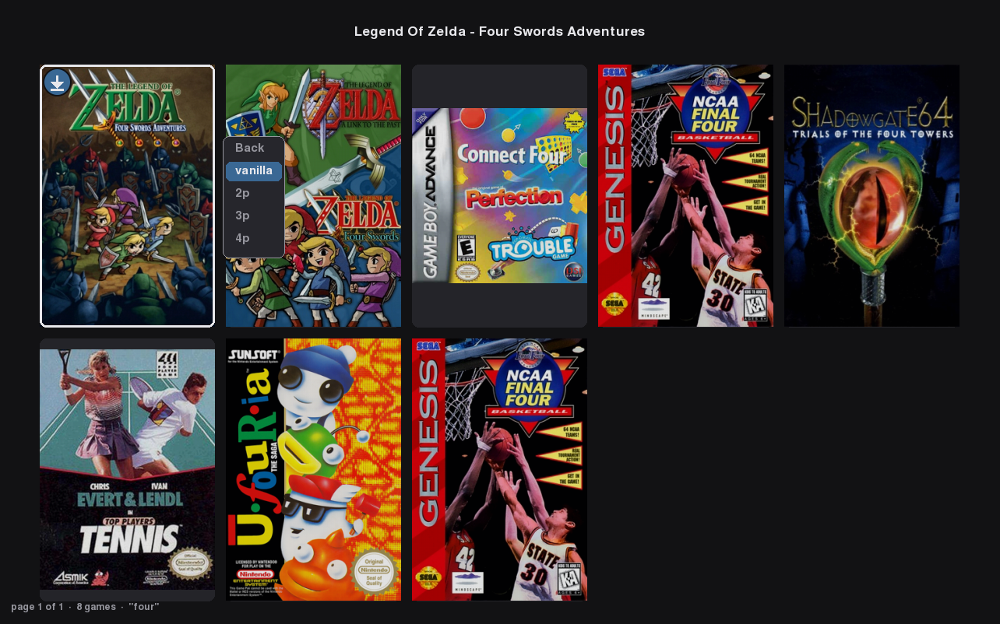

# GamesOnTheGo (GOTG)

A game library you host once and play anywhere. A server holds the catalog,
artwork and saves; a client on each machine (a desktop, a Steam Deck) fetches a
game on first launch, builds the emulator or port it needs with Nix, maps
whatever controllers are plugged in, and runs it — from a terminal, from
Steam, or from a controller-driven picker. Saves go back to the server, so a
game picked up on the Deck continues where the desktop left it.

**GOTG ships no games and downloads none from anyone but your own server.**
It is a library manager and launcher for games you have obtained legally:
cartridges and discs you own and have dumped yourself, or titles bought
digitally. The same goes for console keys and firmware, which some platforms
need to run a game — they come from a console you own. Do not point the
indexer at material you do not have the right to copy.

| Component | Does | Runs |
|---|---|---|
| [indexer](src/gotg/indexer/) | searches a folder for games and indexes them into the catalog, hardlinked into `/Games` | CronJob |
| [service](src/gotg/service/) | serves the catalog, artwork and saves | Deployment |
| [client](src/client/) | `gotg` — fetch, build, launch | Desktop, Steam Deck |
| [picker](src/ui/) | `gotg-ui` — controller-driven game grid | Desktop, Steam Deck |

## Install

Steam Deck (Desktop Mode, Konsole) or any Linux without Nix:

```bash
curl --proto '=https' --tlsv1.2 -fsSL https://raw.githubusercontent.com/dscrawford/GamesOnTheGo/master/install.sh | bash
```

Already have Nix? It is a flake, so no installer:

```bash
nix profile add github:dscrawford/GamesOnTheGo#gotg github:dscrawford/GamesOnTheGo#gotg-ui
```

Or run it without installing anything:

```bash
nix run github:dscrawford/GamesOnTheGo#gotg-ui
```

NixOS or home-manager: add `github:dscrawford/GamesOnTheGo` as a flake input
and put `.packages.${system}.gotg` and `.gotg-ui` in your package list.

Upgrade: re-run the installer, or `nix profile upgrade gotg gotg-ui`.

Uninstall (games and saves stay; `--games` removes them too; Nix stays, and it says how to remove that):

```bash
curl --proto '=https' --tlsv1.2 -fsSL https://raw.githubusercontent.com/dscrawford/GamesOnTheGo/master/uninstall.sh | bash
```

Details, and what the installer does besides: [docs/install.md](docs/install.md).

## Game ids

```
/Games/<platform>/<region>.<title_slug>[.<ext>]     →  id: <region>.<title_slug>
```

- Pattern: `^[a-z]{3,5}\.[a-z0-9][a-z0-9_]*$`; region is `usa`, `eur`, `jpn` or `world`.
- Unique per platform, not globally. Qualify when ambiguous: `snes/usa.mario_is_missing`.

## Client

```bash
gotg login                          # service URL + token → ~/.config/gotg/config.json (0600)
gotg login --claim <url>            # redeem an invite link instead
gotg refresh                        # re-fetch the catalog

gotg list [pattern] [page]          # regex on id, title, platform; * = installed here
gotg list --platform snes --installed --all --limit 100
gotg info <id>                      # size, path, installed, mods
gotg install <id>                   # download + build environment + write launcher
gotg play <id> [variant]            # build what is missing, then launch
gotg play <id> --version 1.4.2      # a particular game update
gotg versions <id> [variant]        # installed updates; * = the one that runs
gotg uninstall <id>                 # removes game and launchers; saves stay
gotg configure <id> [variant]       # the emulator's own settings
gotg configure storage list|add|remove|default <dir>
gotg sync [--force]                 # rebuild after a git pull
gotg version
```

Every command takes `-h`/`--help`. Tab completion: `source ~/.local/state/gotg/app/share/bash-completion/completions/gotg`.


Launch log: `~/.local/state/gotg/logs/<id>.log`.

## Picker

```bash
gotg-ui                             # the grid
gotg steam picker                   # put it in Steam as "Games On The Go"
```

| Pad | Keyboard | Does |
|---|---|---|
| D-pad | arrows | move |
| A | Enter / Space | game menu |
| B | Esc / q | back / quit |
| LB / RB | PgUp / PgDn | page |
| X | `/` or `f` | search |
| Y | — | next platform |
| Start | Tab | menu: Platform, Region, Installed, Search, Clear all, View, Controller for… |
| — | `c` | controller diagram for the selected game's platform |
| — | `i` | installed only |
| — | `s` | storage |

**View** switches between `grid` (10 covers) and `rows` (list + full art).



## Controllers

Launches run through [padmap](https://github.com/dscrawford/padmap): pads are republished via `/dev/uinput`, seated by holding a button, and mapped before the emulator starts.

```bash
gotg controllers list               # what SDL sees
gotg controllers order [--json]     # player order
gotg controllers order --set xbox   # pin player 1; --clear to undo
gotg controllers apply [<id>|--all] # write bindings without launching
```

| Emulator | Consoles | Bindings written to |
|---|---|---|
| ares | NES, SNES, N64, GB, GBC, GBA, Mega Drive | `settings.bml` |
| Dolphin | GameCube, Wii | `GCPadNew.ini` |
| Ryujinx | Switch | `Config.json` |
| Cemu | Wii U | `controllerProfiles/*.xml` |

**Motion:** padmap serves every seated pad's gyro and accelerometer over DSU (`127.0.0.1:26760`, slot = player − 1) and writes each environment's Ryujinx, Cemu and Dolphin config to read it. `PADMAP_DSU_PORT=0` turns it off.

**Stop any game:** hold a shoulder or trigger on each side + Start for 3 s.

**Before a launch**, `gotg-seat` asks for a controller if none is seated, or walks the buttons if the pad is unmapped.

## Steam

```bash
gotg steam add <id> [variant]       # launcher + shortcut + artwork
gotg steam remove <id> [variant]
gotg steam list
gotg steam pending                  # changes queued while Steam is running
gotg steam art <id> [variant] [--force]
gotg steam art <id> --from <file|url> [--as tile|capsule|hero|logo|icon]
```

Close Steam before changes apply; restart it to see them.

## Variants

```bash
gotg play usa.super_mario_sunshine bse
gotg play usa.super_mario_64 pc-4p
gotg play world.legend_of_zelda_tears_of_the_kingdom 120fps --version 1.4.2
```

| Game | Variants |
|---|---|
| `gamecube/usa.super_mario_sunshine` | `bse`, `bsmso` |
| `gamecube/usa.legend_of_zelda_four_swords_adventures` | `2p`, `3p`, `4p` (split-screen) |
| `n64/usa.super_mario_64` | `pc`, `pc-2p`, `pc-3p`, `pc-4p` (sm64coopdx, split-screen) |
| `n64/usa.legend_of_zelda_majoras_mask` | `rando` |
| `n64/usa.legend_of_zelda_ocarina_of_time_rev2` | `rando` |
| `n64/usa.paper_mario` | `recut` |
| `gba/world.pokemon_emerald_version` | `rogue` |
| `switch/world.legend_of_zelda_breath_of_the_wild` | `60fps`, `120fps` (needs 1.6.0) |
| `switch/world.legend_of_zelda_tears_of_the_kingdom` | `60fps`, `120fps`, `enhanced` (needs 1.1.0–1.4.2) |
| `switch/world.legend_of_zelda_skyward_sword_hd` | `120fps` (needs 1.0.1) |
| `switch/world.luigis_mansion_2_hd` | `60fps`, `120fps` |
| `switch/world.kirby_and_the_forgotten_land` | `60fps` |
| `switch/world.paper_mario_the_thousand_year_door` | `60fps` |
| `switch/world.super_mario_rpg` | `120fps` |

A variant whose version range matches nothing installed is hidden; `gotg info <id>` shows why:

```
disabled:  enhanced (needs 1.1.0 to 1.4.2)
```

Native ports, not emulated: Ocarina of Time and Master Quest (Ship of Harkinian), Majora's Mask (2 Ship 2 Harkinian), Donkey Kong 64 (recomp), Super Mario 64 `pc` (sm64coopdx), Paper Mario `recut` (Wine).

## Saves

```bash
gotg saves setup https://gotg.dcraw.net
gotg saves status [<id>|--all]      # compare; writes nothing
gotg saves push   [<id>|--all] [--force]
gotg saves pull   [<id>|--all]
gotg saves adopt  [<id>|--all] [--yes]   # import saves from before isolation
```

- `play` pulls first when the service is ahead and nothing local changed.
- A push against a newer server copy is refused (409) unless `--force`.
- Local history: `~/.local/state/gotg/saves/local/`, last 3 (`GOTG_SAVES_KEEP`).
- Wii U saves are not synced yet.

## Admin

```bash
gotg admin invite alice-deck [--ttl <days>] [--user <user>]   # prints a claim url
gotg admin tokens
gotg admin revoke alice-deck

gotg admin import [--follow]        # run the importer now (needs kubectl)
gotg admin import --match "Breath of the Wild"   # only sources matching; seconds, no sweep
gotg admin scan [--since <when>] [--all] [--json]

gotg admin art warm [--limit N] [--platform p] [--refresh]
gotg admin art status
gotg admin art search "<title>" [--assets N]
gotg admin art set <platform>/<id> <file|url>
gotg admin art show|miss|forget <platform>/<id>
```

```console
$ gotg admin scan
+ gba      usa.mother_3                         Mother 3
- snes     usa.chrono_trigger                   Chrono Trigger (1 of 1 file(s) gone)
1 added, 1 missing since 2026-08-14T09:11:02Z — 2431 in the catalog
```

## Configuration

| File | Contents |
|---|---|
| `~/.config/gotg/config.json` | service URL, token, `flake` |
| `~/.config/gotg/api.json` | `{"url": "...", "token": "..."}` |
| `~/.config/gotg/steamgriddb.json` | `{"api_key": "..."}` |
| `~/.config/gotg/video.json` | `{"resolution": "default\|native\|720p\|1080p\|1440p\|4k\|5k\|1x…8x"}` (Dolphin) |
| `~/.config/gotg/controllers.json` | pinned player order |
| `~/.config/gotg/overrides.json` | per-game `target` / `unzip` (defaults: `src/client/data/overrides.json`) |
| `config/theme.yaml` | picker colours, window, grid/list shape, timeouts |
| `config/icons.yaml` | controller name → icon |
| `config/controllers/*.yaml` | per-controller platforms, padmap layout, control names |

| Variable | Effect |
|---|---|
| `GOTG_FLAKE` | flake to build from (else `flake` in config, `~/Documents/GOTG`, `github:dscrawford/GamesOnTheGo`) |
| `GOTG_SEAT_GATE=0` | skip the pre-launch controller check |
| `GOTG_KILLSWITCH=0` / `GOTG_KILLSWITCH_OVERLAY=0` | disable the stop combo / its overlay |
| `GOTG_KILLSWITCH_HOLD_MS` | stop-combo hold time (default 3000) |
| `GOTG_CONFIG` | picker config directory |
| `GOTG_ADMIN_TOKEN`, `GOTG_INDEX_TOKEN` | admin and importer credentials |
| `GOTG_ART_DIR`, `GOTG_UPSTREAM_RATE` | service: art cache, upstream requests/s |

Private flake:

```bash
NIX_CONFIG="extra-access-tokens = github.com=github_pat_…" gotg play <id>
```

## Environments

```
src/client/env/<platform>.nix                        every game on a platform
src/client/env/games/<platform>/<id>.nix             one game's overrides
src/client/env/games/<platform>/<id>.<variant>.nix   a variant
```

```nix
# src/client/env/games/snes/world.super_metroid.nix
{ ... }: { isolate = true; }
```

## Development

```bash
nix develop                         # gotg, gotg-ui, gotg-seat from the working tree; uv, ruff, shellcheck, bats
nix flake check                     # 1211 python tests, 667 client tests, ruff, shellcheck, drift checks
uv lock                             # after changing pyproject.toml
```
