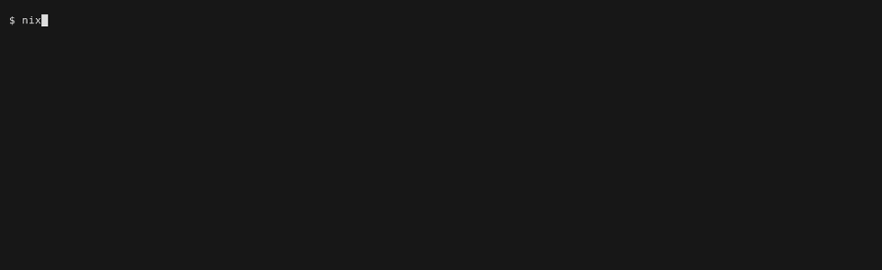
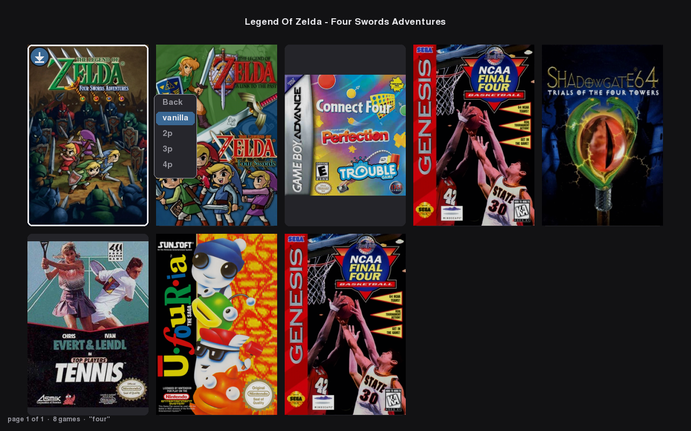
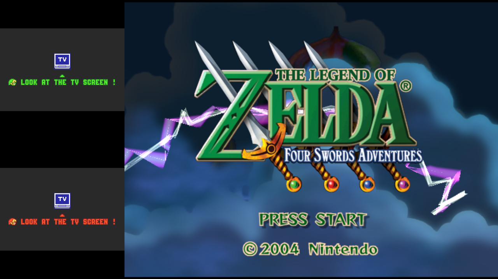

# GamesOnTheGo (GOTG)

Your games, on a server you host; every one of them a Nix flake output.



```bash
nix run gotg#n64.usa.legend_of_zelda_majoras_mask
```

First run: the bytes come down from your server, the emulator or port is
built, the controllers in the room are mapped. Every run: saves are pulled
before and pushed after, the overlay is up, and a game picked up on the Deck
continues where the desktop left it.

**GOTG ships no games and downloads none from anyone but your own server.**
It is for games you have obtained legally: cartridges and discs you own and
have dumped yourself, or titles bought digitally. The same goes for console
keys and firmware. Do not point the indexer at material you do not have the
right to copy.

| Component | Does | Runs |
|---|---|---|
| [indexer](src/gotg/indexer/) | searches a folder for games and indexes them into the catalog, hardlinked into `/Games` | CronJob |
| [service](src/gotg/service/) | serves the catalog, artwork and saves | Deployment |
| [library](templates/library/) | a flake naming your server and pinning its catalog; every game an output | Desktop, Steam Deck |
| [launcher](src/client/) | `gotg` — what a game's output runs: fetch, saves, controllers, overlay | inside every game |
| [picker](src/ui/) | `nix run gotg#ui` — controller-driven game grid | Desktop, Steam Deck |

## Install

Steam Deck (Desktop Mode, Konsole) or any Linux:

```bash
curl --proto '=https' --tlsv1.2 -fsSL https://raw.githubusercontent.com/dscrawford/GamesOnTheGo/master/install.sh | bash
```

What it does, step by step (`bash -s -- --dry-run` prints this and changes nothing):

```console
  GOTG — installing onto this machine
==> Nix is here (already done)
==> flakes are on (already done)
==> making a library in /home/you/.config/gotg/library, of https://gotg.dcraw.net
   would run: nix flake new /home/you/.config/gotg/library -t github:dscrawford/GamesOnTheGo#library
==> signing in to https://gotg.dcraw.net (the token, from whoever runs it)
   would run: nix run github:dscrawford/GamesOnTheGo#login -- --server https://gotg.dcraw.net
==> building the picker, and any game already here, from /home/you/.config/gotg/library
   would run: nix run /home/you/.config/gotg/library#update
   would run: /home/you/.local/state/gotg/app/bin/gotg library /home/you/.config/gotg/library
==> letting GOTG publish controllers (/dev/uinput)
   would ask for your password
==> putting GOTG in your Steam library
   would run: /home/you/.local/state/gotg/app/bin/gotg steam picker
Dry run done. Nothing was changed.
```

Nothing goes in a Nix profile. The **library** is the install: a flake in
`~/.config/gotg/library` naming your server and pinning its catalog, each game
an output of it ([docs/nix-games.md](docs/nix-games.md)). `--server
https://games.example.org` makes it a library of another server;
`--claim <url>` signs in with an invite link. With Nix already here, the
whole of it by hand:

```bash
nix flake new ~/.config/gotg/library -t github:dscrawford/GamesOnTheGo#library
nix run github:dscrawford/GamesOnTheGo#login     # the token first: the catalog is fetched with it
nix flake lock ~/.config/gotg/library            # by its path; a lock is not written through the registry
nix registry add gotg ~/.config/gotg/library     # so it is gotg#… from anywhere, as below
```

Upgrade: the installer again, or `nix flake update gotg --flake ~/.config/gotg/library && nix run gotg#update`.
Uninstall: the same line with `uninstall.sh` (`--games` takes games and saves too; Nix stays).
More: [docs/install.md](docs/install.md).

## Play

With a token and nothing else -- no library, no install -- one line:

```bash
GOTG_TOKEN=… nix run github:dscrawford/GamesOnTheGo#play -- n64.usa.donkey_kong_64
```

It makes the library in `~/.config/gotg` from the token (which it keeps, so
the next run needs only the game), and runs the game by the library's path.
Everything below is the same library, by its registry name:

```console
$ nix search gotg majora
* legacyPackages.x86_64-linux.n64.usa.legend_of_zelda_majoras_mask
  Legend Of Zelda - Majora's Mask (n64)

$ nix run gotg#n64.usa.legend_of_zelda_majoras_mask
```

An id is `<region>.<title_slug>`, unique per platform, so the attribute is
`<platform>.<region>.<title>`; `gotg#usa.legend_of_zelda_majoras_mask` works
when the id is on one platform only.

```bash
nix run gotg#n64.usa.legend_of_zelda_ocarina_of_time_rev2.rando        # a variant
nix run gotg#n64.usa.donkey_kong_64.emulate                              # a native port, back on the emulator
nix run gotg#switch.world.legend_of_zelda_tears_of_the_kingdom -- --version 1.4.2   # one of its updates
nix flake update catalog --flake ~/.config/gotg/library                  # games added on the server since
```

Behind every game is the launcher, `gotg`, which the library builds and nobody
installs: `~/.local/state/gotg/app/bin/gotg`. It answers `help`; the `gotg …`
lines further down are that program. Launch log: `~/.local/state/gotg/logs/<id>.log`.

## Picker

```console
$ nix run gotg#ui -- --list --search zelda --platform n64
n64       jpn.zelda_no_densetsu_mujura_no_kamen_rev1 Zelda No Densetsu - Mujura No Kamen
n64       usa.legend_of_zelda_majoras_mask         Legend Of Zelda - Majora's Mask
n64       usa.legend_of_zelda_ocarina_of_time_master_quest Legend Of Zelda - Ocarina Of Time - Master Quest
n64       usa.legend_of_zelda_ocarina_of_time_rev2 Legend Of Zelda - Ocarina Of Time
page 1 of 1 · 7 games
$ nix run gotg#ui                         # the grid itself
$ nix run gotg#steam -- picker            # in Steam, as "Games On The Go"
```



| Pad | Keyboard | Does |
|---|---|---|
| D-pad | arrows | move |
| A | Enter / tap `Space` | game menu: Play, Install, mods, versions, saves, Steam |
| B | Esc / q | back / quit |
| LB / RB | PgUp / PgDn | page |
| X | `/` or `f` | search |
| Y | — | next platform |
| Start | Tab | menu: Platform, Region, Installed, Search, Clear all, View, Controller for… |
| hold any button | hold `Space` | take a free seat — the pad (or keyboard) icon above the grid fills in, then you are that player |
| — | `c` | controller diagram for the selected game's platform |
| — | `i` | installed only |
| — | `s` | storage |

Install from the menu runs behind the grid, a ring on the tile; Play on a game
that is not here yet shows the download and the build on screen, then becomes
the game.



## Controllers

```console
$ gotg controllers list
Steam Controller
  binds as   03002854de2800000413000002006800/0
  reached by /dev/hidraw2 (raw HID, no evdev node)
  mapping    32 elements
  motion     gyro and accelerometer — used by Ryujinx and Cemu
```

Launches run through [danstick](https://github.com/dscrawford/danstick):
pads are republished via `/dev/uinput`, seated by holding a button, and bound
before the emulator starts -- ares (`settings.bml`), Dolphin (`GCPadNew.ini`),
Ryujinx (`Config.json`), Cemu (`controllerProfiles/*.xml`). Motion goes over
DSU (`127.0.0.1:26760`, slot = player − 1); `DANSTICK_DSU_PORT=0` turns it off.

**Every session starts with nobody seated**, picker and game alike. Pick a
controller up, hold a button for a second and a half, and the bar at the top
fills in your colour: you are player one, the next to hold is player two, and
that is the numbering every game is bound against. A controller danstick has
no buttons for gets them walked right there, over the game.

**L + R + A** held half a second brings a menu down for that player alone:
the seats as a row of controller icons; the game's controller under them,
every press lighting the presser's icon beside the button it hit; A rebinds
yours, A held then left/right moves your seat, X takes a controller out of
its seat, Y turns its game port off or on, a save to load, and **Exit** (held)
stops the game and pushes its saves. **L + R + Start** held three seconds
stops any game.

Only pads danstick has published move the picker -- the keyboard takes a seat
too (hold `Space`), and a controller that is also a keyboard (a Steam
Controller in lizard mode, a Bluetooth Xbox pad's extra collections) is held
quiet at the kernel while the picker runs. That is a requirement with a test
against a real daemon and real kernel devices:

```bash
nix run github:dscrawford/GamesOnTheGo#test-controllers      # needs /dev/uinput writable, nothing else
```

```bash
gotg controllers list --as-game      # what a game sees: inside danstick's sandbox, clones only
gotg controllers order --set xbox    # pin player 1; --clear to undo
gotg controllers apply [<id>|--all]  # write bindings without launching
```

## Steam

```console
$ nix run gotg#steam -- list
Legend Of Zelda - Majora's Mask
  /home/you/Games/n64/play-usa.legend_of_zelda_majoras_mask.sh
Paper Mario (recut)
  /home/you/Games/n64/play-usa.paper_mario-recut.sh
Games On The Go
  /home/you/.local/state/gotg/launchers/gotg-ui.sh
```

`add <id> [variant]` writes the launcher, the shortcut and the artwork;
`remove <id>`; `pending` is what queued while Steam was open; `art <id>
[--from <file|url>] [--as tile|capsule|hero|logo|icon]`. Steam reads that
file once, at startup, and rewrites it from memory when it exits: close it
before changes, restart it to see them. The rest of what it cost to find out:
[docs/steam.md](docs/steam.md).

## Variants

```console
$ nix eval --raw gotg#n64.usa.legend_of_zelda_ocarina_of_time_rev2.rando.gotgSpec.attr
env-n64-usa_legend_of_zelda_ocarina_of_time_rev2-rando
```

| Game | Variants |
|---|---|
| `gamecube.usa.super_mario_sunshine` | `bse`, `bsmso` |
| `gamecube.usa.legend_of_zelda_four_swords_adventures` | `2p`, `3p`, `4p` (split-screen) |
| `n64.usa.super_mario_64` | `pc`, `pc-2p`, `pc-3p`, `pc-4p` (sm64coopdx, split-screen) |
| `n64.usa.legend_of_zelda_majoras_mask` | `rando` |
| `n64.usa.legend_of_zelda_ocarina_of_time_rev2` | `rando`, `2p`, `3p`, `4p` (Anchor co-op, split-screen) |
| `n64.usa.paper_mario` | `recut` |
| `gba.world.pokemon_emerald_version` | `rogue` |
| `switch.world.legend_of_zelda_breath_of_the_wild` | `60fps`, `120fps` (needs 1.6.0) |
| `switch.world.legend_of_zelda_tears_of_the_kingdom` | `60fps`, `120fps`, `enhanced` (needs 1.1.0–1.4.2) |
| `switch.world.legend_of_zelda_skyward_sword_hd` | `120fps` (needs 1.0.1) |
| `switch.world.luigis_mansion_2_hd` | `60fps`, `120fps` |
| `switch.world.kirby_and_the_forgotten_land` | `60fps` |
| `switch.world.paper_mario_the_thousand_year_door` | `60fps` |
| `switch.world.super_mario_rpg` | `120fps` |

A variant is a file: `src/client/env/games/<platform>/<id>.<variant>.nix`,
beside `<id>.nix` for one game's settings and `<platform>.nix` for the rest.
One whose version range matches nothing installed is hidden from the picker.

Native ports, not emulated: Ocarina of Time and Master Quest (Ship of
Harkinian), Majora's Mask (2 Ship 2 Harkinian), Donkey Kong 64 (recomp),
Snowboard Kids 2 (recomp), Super Smash Bros. (BattleShip), Pikmin (Open
Nectar), Super Mario 64 `pc` (sm64coopdx), Paper Mario `recut` (Wine), Animal
Crossing (ACGC PC Port, Wine), Super Smash Bros. Melee (melee-pc). Each has
an `.emulate` attribute that puts it back on the emulator: a port is younger
than what it replaces, and that is how you find out which of the two has the
bug.

## Saves

```bash
gotg saves status [<id>|--all]      # compare; writes nothing
gotg saves push   [<id>|--all] [--force]
gotg saves pull   [<id>|--all]
gotg saves check  <id> [variant] [--json]       # conflict? which machine, and when
gotg saves keep   <id> [variant] here|remote    # settle one
```

A launch pulls first when the server is ahead and nothing local changed, and
pushes on the way out. **Both sides changed since they last matched** is a
conflict: starting that game from the picker shows both saves -- the machine
each is on and when -- and keeps the one you pick, the other set aside. A
push against a newer server copy is refused (409) unless `--force`. Local
history: `~/.local/state/gotg/saves/local/`, last 3. Wii U saves are not
synced yet.

## QA

```console
$ gotg qa usa.donkey_kong_64 --machine deck --overlay-at 20
running Donkey Kong 64 headless for 60s here, standing in for a deck

run:     ~/.local/state/gotg/qa/runs/20261001-171902-Cxih
machine: deck
  boots     pass
  audio     pass
  video     pass
  controller pass
  graphics  skip
  overlay   pass
```

A minute of the game under a headless compositor with a virtual pad, graded
for boot, sound, motion, input and the overlay coming down. `--machine deck`
is a Steam Deck's profile (no host GL, X11, C locale) and says whether it ran
on the real one or a stand-in; `--spec <file>` is a game exactly as its
output launches it; `--bless` keeps the frame as the golden image.
`nix run github:dscrawford/GamesOnTheGo#qa`.

## Admin

```console
$ gotg admin scan
+ gba      usa.mother_3                         Mother 3
- snes     usa.chrono_trigger                   Chrono Trigger (1 of 1 file(s) gone)
1 added, 1 missing since 2026-08-14T09:11:02Z — 2431 in the catalog
```

Administration is on the tailnet only: `http://100.64.0.1:30781/admin/`
in a browser is a page to invite someone (it hands you the claim link and the
command they run), see every token and when it was last used, and revoke one.
The public url answers `/admin` with a 404 saying so; the service splits it
off with `GOTG_ADMIN_PORT` (and `GOTG_ADMIN_URL`, `GOTG_PUBLIC_URL`).

From a terminal, the same, with `admin_url` in `~/.config/gotg/api.json` or
`GOTG_ADMIN_URL`: `invite <name>` prints a claim url for one person and device
(`nix run gotg#login -- --claim <url>` redeems it); `tokens`, `revoke <name>`;
`import [--follow] [--match <re>]` runs the indexer now; `art warm|status|search|set`;
`scan` is the library pod's, `GOTG_ADMIN_URL=http://100.64.0.1:30782`.
`nix run github:dscrawford/GamesOnTheGo#admin`.

## home-manager

```nix
programs.gotg = {
  enable = true;
  library = inputs.library;      # a flake made from gotg#library
  games = [ "n64.usa.donkey_kong_64" "gamecube.usa.super_smash_bros_melee_rev2" ];
};
```

`inputs.gotg.homeManagerModules.gotg`: the picker and those games on PATH.
The token stays `#login`'s, 0600, never in the store.

## Configuration

| File | Contents |
|---|---|
| `~/.config/gotg/library/` | the library flake: server, catalog pin (`flake.lock`) |
| `~/.config/gotg/api.json` | `{"url": "...", "token": "..."}` |
| `~/.config/gotg/netrc` | the token, for Nix to fetch the catalog |
| `~/.config/gotg/config.json` | `library`: the writable library games are built from |
| `~/.config/gotg/steamgriddb.json` | `{"api_key": "..."}` |
| `~/.config/gotg/video.json` | `{"resolution": "default\|native\|720p\|1080p\|1440p\|4k\|5k\|1x…8x"}` (Dolphin) |
| `~/.config/gotg/controllers.json` | pinned player order |
| `~/.config/gotg/overrides.json` | per-game `target` / `unzip` (defaults: `src/client/data/overrides.json`) |
| `config/theme.yaml` | picker colours, window, grid/list shape, timeouts |
| `config/icons.yaml` | controller name → icon |
| `config/controllers/*.yaml` | per-controller platforms, danstick layout, control names |

| Variable | Effect |
|---|---|
| `GOTG_LIBRARY` | the library to build from (else `library` in config, else the one an app was run from) |
| `GOTG_KILLSWITCH=0` / `GOTG_KILLSWITCH_OVERLAY=0` | disable the stop combo / its overlay |
| `GOTG_KILLSWITCH_HOLD_MS` | stop-combo hold time (default 3000) |
| `GOTG_CONFIG` | picker config directory |
| `GOTG_ADMIN_TOKEN`, `GOTG_INDEX_TOKEN` | admin and importer credentials |
| `GOTG_ART_DIR`, `GOTG_UPSTREAM_RATE` | service: art cache, upstream requests/s |


## Development

```bash
nix develop                         # gotg, gotg-ui from the working tree; uv, ruff, shellcheck, bats
nix flake check                     # python tests, client tests, ruff, shellcheck, drift checks
uv lock                             # after changing pyproject.toml
```

## License

[MIT](LICENSE).
